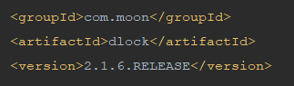
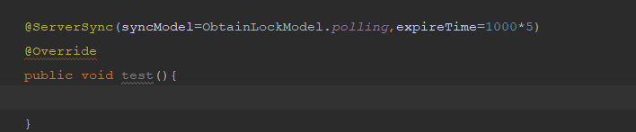

#dlock（分布式应用锁）的使用方式
##dlock使用方式非常简单，下载源码https://github.com/lengkristy/dlock.git，然后编译安装到本地maven。
##1、项目引用 
在自己的项目中通过maven的方式， 

##2、配置redis 
分布式应用锁的轮询实现方式是通过redis的实现，需要在自己的项目中配置redis，并且redis的版本需要在2.8版本以上。
##3、配置activemq
分布式应用锁的阻塞实现方式是通过activemq实现，需要在自己的项目中配置activemq即可。
##4、使用同步机制 
自己的项目中有需要做同步的地方加上ServerSync注解即可。
 
参数ObtainLockModel（获取锁的模式）有两种，第一种polling为轮询，默认为polling，第二种为block，阻塞，polling的方式主要是用redis实现，block的方式主要是用activemq方式实现。
